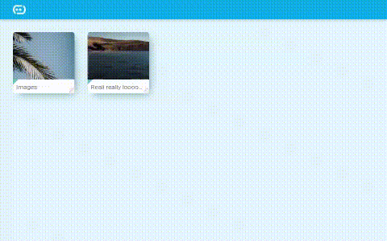

# initialxy-file-server

Yet another Raspberry Pi project of mine. This is a personal project, **not meant for production usages**. This project serves as an intentionally minimal file server that allows you to browse file directories from a configured directory. It is meant to be engaging, colorful and easy to use for kids, so you can put your own photos, study materials etc on Amazon Kids (FreeTime) tablets in an organized fashion.

# Technial background
One might ask, there are already tons of open source file servers out there. Why reinvent the wheel? As a matter of fact, I did put [Nextcloud](https://github.com/nextcloud) on my Raspberry Pi 3 and it works. But it's choking both the Raspberry Pi as well as Amazon Fire. Furthermore, its UI is much more advanced, and certainly not kids friendly. This project is meant to be light weight and intentionally minimal. I took this opportunity to update myself on Python 3.8 and Vue 3.0. It's a fun learning experience for me.

Like I mentioned, this project serves as a learning tool for me. So like my other projects, its technical choices are intentionally quirkly. The theme for this project is to achive near complete type safety across the entire web stack. Though it would have been easier to use one language across the stack, the challenge of this project is to accomplish type safety across Python and JavaScript, two extremely popular languages that's traditionally been weakly typed.

# Prerequisites
* Python 3.7+
* npm 6.14.8+
* node 14.9.0+

# Build and run
I used [venv](https://docs.python.org/3/library/venv.html) to create a virtual env first, though that's optional. On an actual Raspberry Pi, installing OpenCV from pip was actually quite difficult. I followed [this guide](https://pimylifeup.com/raspberry-pi-opencv/) to install build tools and bumped swap to 2GB for OpenCV to finally successfully build with pip, though I'm not sure which of these steps is actually necessary. It took me over 2 hours to build OpenCV on my Raspberry Pi 3, so I'm not going back to retry with different configurations. It's probably easier to just install prebuilt binaries from apt instead. ie.

    sudo apt install python3-opencv

Nevertheless, here is the full build steps

    python3 -v  # 3.7 and above
    python3 -m venv venv #  You can choose a different name
    source venv/bin/activate
    pip install -r requirements.txt  # OpenCV will take over 2 hours
    cd frontend
    npm install
    cd ..
    ./build

To run this app in dev mode

    ./run --debug

Then open a second terminal instance and run

    cd frontend
    npm run dev

Go to http://localhost:8080 in your browser.

To run this app in prod mode without sourcing venv

    sudo ./run

Alternatively, if you opt not to use venv

    sudo python3 api.py

Note that `sudo` is needed to acquire port 80. Amazon Kids browser will not work with any other port. If you wish to change it, then you can edit it in `appconfig.json`.

# Configure
Open `appconfig.json` and you can set the root directory where you want files to be served as well as port. Again, keep in mind that port should set to 80 in order for it to work in Amazon Kids, but 8000 for dev mode. If you were to change `devPort`, then you also need to change it in [frontend code](https://github.com/initialxy/initialxy-file-server/blob/master/frontend/src/utils/URL.ts), which assumes backend will run on port 8000.

You can create a `thumbnail.jpg` under a folder to serve as folder thumbnail. Thumbnails for image and video files will be automatically generated (at the best ability of OpenCV) and stored in a folder named `__thumbnails`.

# Reminder
Files can only be opened at the capabilities of Amazon Silk browser. If a file format cannot be handled by Silk browser, then nothing will happen in Amazon Kids (though it will attempt to download in normal mode). So make sure you convert your files to a web friendly format ahead of time. eg. mp4, m4v, jpg etc.

# License
MIT